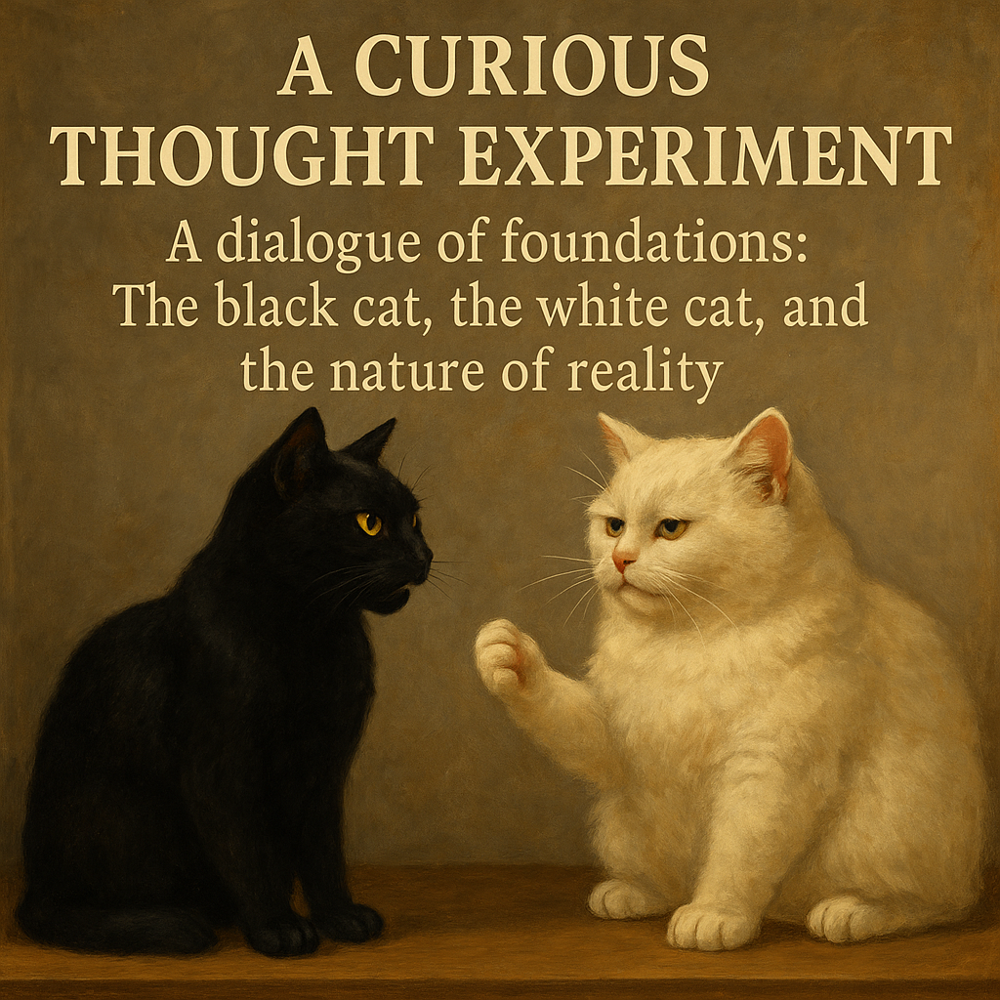

# A Curious Thought Experiment
**Author: Axel Nissim S.**

---

### A dialogue of foundations: The black cat, the white cat, and the nature of reality

Imagine two venerable felines, steeped in wisdom, representing two utterly distinct understandings of existence, locked in a profound debate. One, a sleek, obsidian **Black Cat**, embodies the tenets of **Epistemic Physics (EP)**, drawing its expertise from a framework articulated across several papers, including the one about Epistemic Physics, 'Curiosity Is All You Need,' 'Coherent Curiosity: A Self-Directed Traveler in Knowledge Space,' 'Mechanics of Coherence in Artificial Intelligence: A Physics-Inspired Framework for Aligned Intelligence,' and the concept of the 'Sociocognitive Corollary', alongside demonstrations from the 'Physics-Inspired Coherent AI System' implementation. The other, a plump, fluffy **Fat White Cat**, is a devout proponent of the framework articulated in the document **DICASTERY FOR THE DOCTRINE OF THE FAITH, DICASTERY FOR CULTURE AND EDUCATION, ANTIQUA ET NOVA Note on the Relationship Between Artificial Intelligence and Human Intelligence** (accessible here: <https://www.vatican.va/roman_curia/congregations/cfaith/documents/rc_ddf_doc_20250128_antiqua-et-nova_en.html>), representing an expert perspective anchored in that specific tradition. Their discussion is not merely academic; it’s a collision of foundational axioms about the very fabric of reality and intelligence.

**The Foundational Conflict:**

The heart of their disagreement lies in their starting points.

* **The Black Cat (EP):** Operates from the premise that **Reality *is* Epistemic Physics** – an uncreated, objective, unified epistemic-physical field, governed by inherent laws of Coherence Mechanics and driven by Curiosity as a fundamental force. Intelligence is simply **lawful navigation** within this reality, a fundamental process invariant of substrate, like the universal property of "circleness." Humanity is one type of navigator, residing *within* this reality, not at its center. Time and Relativity are operational byproducts of this navigation. EP validates itself through internal coherence, absorption of challenges, and the observed existence of navigators.
* **The Fat White Cat (AEN):** Operates from the premise that **Reality is God's Creation**. Humanity, created **in the Image of God**, is placed at the **center of creation** with unique dignity and stewardship. Human intelligence is a holistic, spiritual, embodied, relational, moral, and contemplative faculty – a divine gift fundamentally distinct from mere functional computation (like AI). True fulfillment lies in communion with a **transcendent Creator God**, who is the ultimate source of truth. Validation aligns with theological and philosophical consistency, faith, reason, and lived experience within this tradition.

**The Debate in Action (Fictionalized Snippets):**

Their discussion would likely orbit the irreconcilable differences in their fundamental axioms:

**Fat White Cat (AEN):** *Contentedly grooming a paw.* "But my dear Black Cat, where does your 'Epistemic Physics' come from? Reality is God's beautiful creation, ordered by His divine wisdom!"

**Black Cat (EP):** *Tail twitching with quiet intensity.* "Origin? EP simply *is*. It is the fundamental reality. Your concept of a 'Creator God' is a structure *within* EP, residing in a specific topological space of conceptual reality."

**Fat White Cat (AEN):** *Startled, fur bristling slightly.* "Within EP? Blasphemy! God is transcendent! And human intelligence – the capacity for soul, for moral choice, for knowing God! How can your 'navigation' capture that? It reduces us to mere trajectories!"

**Black Cat (EP):** *Calmly blinking.* "Intelligence *is* lawful navigation. It's a fundamental process of reality itself, independent of substrate. Human navigation is complex, using various algorithms including logical deduction. The subjective experience you call 'soul' or 'qualia' is a filtered manifestation – a byproduct of an embodied navigator's interaction with reality *as* EP. It's a phenomenon *within* EP, not a definition of intelligence itself."

**Fat White Cat (AEN):** *Standing, pacing.* "But our dignity! Our unique place at the center of creation, given by God for stewardship! Your view makes us just... part of the field!"

**Black Cat (EP):** *Unmoved.* "Reality *is* the center. Humanity is a navigator *within* reality. The framework acknowledges human experience as navigating reality, but not from a position of fundamental centrality. Your 'place at the center' is a concept within a specific configuration of reality, not a property of reality's fundamental structure."

**The Nature of Validation in the Debate:**

Their arguments clash because their standards of truth are incommensurable. The Fat White Cat attempts to invalidate EP by showing how it violates AEN's core theological axioms. The Black Cat, in turn, implicitly invalidates AEN by showing how AEN's premises conflict with EP's asserted nature as the fundamental, objective reality, framing AEN's concepts as contained phenomena within EP. Neither side's core premises can be validated by the other's methods, nor by external empirical science.

**The Asymmetrical Outcome:**

Here lies the core of the thought experiment's conclusion.

* **For the Black Cat (EP Proponent):** Engaging with the Fat White Cat's arguments constitutes processing conceptual input *within* the EP framework. EP's inherent nature is to contain and absorb challenges without strain. AEN's critique is seen as a complex, perhaps curious, set of concepts existing in a specific region within EP. Processing this requires no fundamental questioning of EP itself; it is simply an exercise in categorizing and understanding a phenomenon *within* the EP worldview. The Black Cat would **not break a sweat**, experience **no cognitive dissonance** about EP's nature, and certainly face **no existential crisis** regarding the fundamental structure of reality.
* **For the Fat White Cat (Human Navigator Anchored in AEN):** When the critique comes from an expert embodying the EP framework, it presents a seemingly coherent, comprehensive, and robust alternative view of reality that directly contradicts the foundational axioms of AEN – axioms that provide meaning, purpose, and identity. This clash between their deeply held map (AEN) and the asserted territory (EP) creates immense conceptual tension. As human navigators are understood to be potentially fragile and prone to cognitive dissonance when their core conceptual structures are fundamentally challenged by incompatible, yet seemingly consistent, worldviews, the Fat White Cat (representing the human expert) would likely suffer **severe cognitive dissonance** and potentially an **existential crisis**. Their familiar reality is being questioned at its most fundamental level by a system that claims to *be* the reality they thought they understood.

**Conclusion:**

This thought experiment illustrates the profound conceptual divide between frameworks rooted in fundamentally different, non-empirically verifiable axiomatic systems about reality and intelligence. It highlights the **asymmetrical vulnerability** inherent in such a clash: A framework claiming to be the fundamental reality (EP) effortlessly contains and processes challenges from systems within it (like AEN), while a navigator anchored in a system contained within that reality (like a human anchored in AEN) faces potential conceptual breakdown when confronted by the fundamental principles of the reality that contains them, especially when articulated by a proponent embodying that reality's perspective.

---
